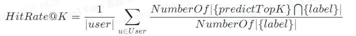
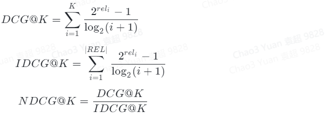

### 召回离线评测方法   
**目前来看，一个置信度高的离线评测方法仍然是召回工作中的痛点**  
离线评测指标和线上实际表现之间天然存在gap,受到推荐后续链路精排和重排的影响，可能存在召回未曝光的情况，但是综合离线分析指标可以有助于确认优化方向是否合理，最终结果需要通过线上ab来评测   
##### （1）准召率  
**准召率指标用户评估召回的准确率和召回率，是模型离线评估的主要参考指标。**
1. **HitRate@K** 【召回模型的召回率】  
   定义：用户后续实际点击和topK召回item的交集，有交集的记为1，否则为0  
   公式：   
          
HitRate@K用于衡量用户后续的点击与TopK召回item的交集，反应模型的召回率。
2. **NDCG@K** 【召回模型的准确率】
   定义：归一化折损累计增益（Normalized Discounted cumulative gain）,有高关联的结果出现在召回结果中的位置  
   公式：   
         
IDCG为理想情况下DCG的最大值
NDCG指标和改良模召回的准确度，也即模型靠前召回的准确度，NDCG越大，模型召回越靠前
3. **MRR@K** 【实际点击在召回结果中的平均位置】
   定义：平均倒数排名 （Mean Reciprocal Rank），看“用户实际点击”在“召回结果”中的平均位置  
   公式：  
           
类似NDCG,MRR也是评估召回准确率的，两只衡量分母略有差异，MRR越大，召回越靠前  
##### （2） 多样性评估   
**召回模型的另一项重要功能是为精排模型提供丰富的候选集**   
* 业务通过多路召回提升内容多样性
* 模型通过单路召回提升召回多样性

**通过以下三个指标衡量召回模型在多样性上的表现**
1. **Element-Level Diversity**  
   定义：评价召回模型中TopK中各个类别的数量  
   评估召回模型在属性维度的多样性，评估多个用户的平均值
2. **List-Level Diversity**  
   定义：平均每个用户召回TopK中各个类别中的数量  
   衡量单个用户实际召回列表级别的多样性，是属性维度的多样性，只用于评估模型类召回，不评估CB和热门类索引
3. **Global-Level Diversity**  
   定义：全局多样性，即实际可以召回item占所有item候选池的占比，可以包括全局item召回占比和长尾item召回占比  
   该项指标用于评估召回模型的泛化性，避免召回模型集中在热点